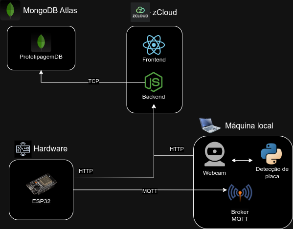
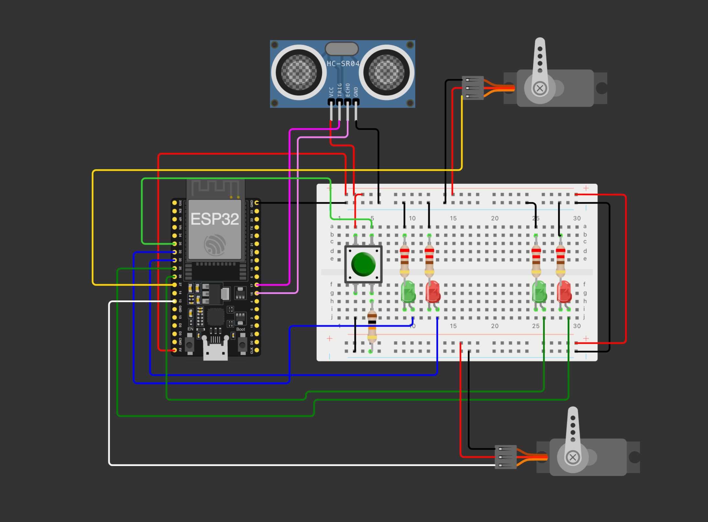

# Sistema de detecção de placas e controle de veículos de carga

## Integrantes

- Luís Henrique Lima Santos
- Luiz Eduardo Bronzeado Pessoa
- Lucas Bivar Fonseca Tavares
- João Victor Negreiros da Silva
- Jorge Vinicius Castro

## Descrição

A aplicação é voltada para controle do fluxo de veículos de carga, como caminhões em rodovias interestaduais.

O fluxo de pesagem passa a ser o seguinte:

1. Veículo de carga para em uma primeira cancela, onde são coletadas as informações da sua placa, as informações do motorista e informações de carga por intermédio da nota fiscal.
2. Após etapa 1, o veículo passa para uma plataforma, onde novamente ficará atrás de uma segunda cancela. O automóvel será pesado. Toda essa informação será guardada e atualizada em tempo real, podendo ser checada por meio de um aplicativo web.
3. Após pesagem e verificação dos dados e histórico do motorista, o veículo passa a segunda cancela, e é descarregado.
4. Após a descarga do veículo de carga, ele volta pela mesma segunda cancela e é pesado novamente. Nesta etapa é calculada a diferença de peso e comparada com o peso da carga descrito na nota fiscal.
5. Caso não haja nada suspeito e tudo esteja conforme, o automóvel será carregado e poderá seguir viagem
6. Caso contrário, motorista será encaminhado e veículo é detido

Confira uma demo do projeto em execução clicando [aqui](https://www.youtube.com/watch?v=y9jM6nrJ87I). 

## Objetivo

Por meio do desenvolvimento desta aplicação, espera-se obter a automação parcial/total das etapas de verificação de veículos de carga.

O protótipo visa auxiliar no processo de coleta de informações de placas de veículos e dos seus motoristas, possibilitando um melhor controle no fluxo destes automíveis.

## Funcionamento

A tecnologia possibilitará realizar a detecção de placas por meio de uma camêra. Após a leitura e captura da placa, os dados são enviados para um servidor web mediante o protocolo HTTP, onde será confirmado os dados lidos e então é realizado a pesagem do veículo de carga e identificação do motorista. Com todos os dados coletados, é então feita a verificação se os dados cadastrados estão de acordo. Caso positivo, o fluxo é liberado, caso contrário, segue-se os protocolos policiais.

## Justificativa

Realizar monitaramente e controle de veículos de carga, bem como garantir que os mesmos circulando corretamente de acordo com normas fiscais, de valor de carga máxima permitida, até motorista cadastrado

## Requisitos funcionais

- Sistema Web para cadastro de pesagem (Motorista, Veículo e Nota Fiscal)
- Sistema Web com histórico de pesagens
- Acompanhamento em tempo real do status da pesagem no Sistema Web
- Gerar ticket no Sistema Web após finalização da pesagem
- Realizar Reconhecimento Ótico de Caracteres (OCR) de uma placa de carro através de uma câmera
- Liberar entrada do caminhão para primeira pesagem levantando a cancela, apagando o led vermelho e acendendo o led verde
- Liberar a saída do caminhão da primeira pesagem levantando a cancela, apagando o led vermelho e acendendo o led verde
- Liberar entrada do caminhão para segunda pesagem levantando a cancela, apagando o led vermelho e acendendo o led verde
- Liberar a saída do caminhão da segunda pesagem levantando a cancela, apagando o led vermelho e acendendo o led verde
- Só fechar a cancela de entrada quando o caminhão estiver na plataforma de pesagem
- Só fechar a cancela de saída quando o caminhão não estiver mais na plataforma de pesagem
- Se acontecer algum problema na pesagem, os dois leds vermelhos devem ficar piscando continuamente a cada 2 segundos até a liberação do caminhão
- Botão para liberar a saída do caminhão dentro da casa de pesagem (utilizar quando acontecer algum problema na pesagem)
- Conectar ESP32 com Broker MQTT, e Cloud através da API 
- Conectar Sistema de Reconhecimento da Placa com Broker MQTT, e Cloud através da API

## Requisitos não funcionais

- Garantir que não haja latência na comunicação entre os serviços
- Interface simples e intuitiva no aplicativo web, sempre guiando os proximos passos, para que os fiscais consiga realizar o controle sem complicações

## Softwares utilizados no projeto:

- **Linguagem de programação Python**: Utilizada para treinar um modelo de reconhecimento de placas de veículos
- **Linguagem de programação Javascript**: Utilizada para desenvolvimento da aplicação back-end e front-end
- **Linguagem de programação C++**: Utilizada para Firmware no microcontrolador
- **MongoDB**: Banco de dados não relacional utilizado para armazenar todos os dados coletados

## Descrição arquitetural
O frontend e o backend estão hospedados na nuvem, no serviço de nuvem da [zCloud](https://zcloud.ws). O MongoDB está hospedado no serviço do MongoDB Atlas.
Já a parte de reconhecimento visual da placa, o código do microcontrolador e o broker MQTT são executadas numa máquina localmente juntamente do hardware.

    

## Como executar o projeto
Caso deseje executar o projeto localmente na sua máquina, siga os passos descritos na nossa [documentação técnica](./TECHNICAL-README.md).

## Esquemático eletrônico
Para a construção do esquemático foi utilizado a plataform Wokwi.
Clique [aqui](https://wokwi.com/projects/383032811868797953) para visualizar a página do circuito do projeto.

Preview:

    

## Recursos para realização do projeto

- **1 ESP32**
- **1 Web-Cam**
- **2 Placas de Isopor**
- **Jumpers**
- **Resistores**
- **Protoboard**
- **2 Micro Servo SG90.**
- **2 LEDS Verdes**
- **2 LEDS Vermelhos**
- **1 Push Button**
- **1 Sensor Ultrassônico HC-SR04**
- **Serviço de hospedagem em cloud**

## Vídeo demonstração

Clique [aqui](https://www.youtube.com/watch?v=OpqCC4ew-GU) para ter acesso ao vídeo de demonstração

